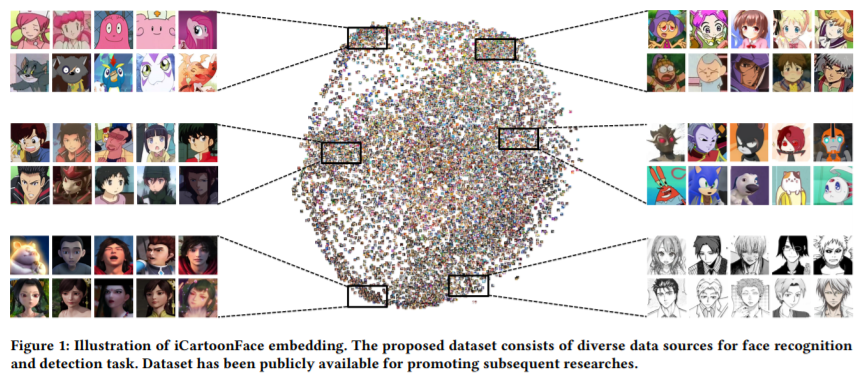

# Cartoon Character Recognition

Since the 1970s, face recognition has become one of the most important topics in the field of computer vision and biometrics. In recent years, traditional face recognition methods have been replaced by the deep learning method based on convolutional neural network (CNN). At present, face recognition technology is widely used in security, commerce, finance, intelligent self-service terminal, entertainment and other fields. With the strong demand of industry application, animation media has been paid more and more attention, and face recognition of animation characters has become a new research field.

## 1 Pipeline

See the pipline of [feature learning](./feature_learning_en.md) for details. It is worth noting that the `Neck` module is not used in this process.

The config file: [ResNet50_icartoon.yaml](../../../ppcls/configs/Cartoonface/ResNet50_icartoon.yaml)

 The details are as follows.

### 1.1 Data Augmentation

- `RandomCrop`: 224x224
- `RandomFlip`
- `Normlize`:  normlize images to 0~1

### 1.2 Backbone

`ResNet50` is used as the backbone. And Large model was used for distillation.

### 1.3 Metric Learning Losses

`CELoss` is used for training.

## 2 Experiment

 This method is validated on icartoonface [1] dataset. The dataset consists of 389678 images of 5013 cartoon characters with ID, bounding box, pose and other auxiliary attributes. The dataset is the largest cartoon media dataset in the field of  image recognition.

Compared with other datasets, icartoonface has obvious advantages in both image quantity and entity number. Among them, training set inclues 5013 classes, 389678 images. The query dataset has 2500 images and gallery dataset has 20000 images.

It is worth noting that, compared with the face recognition task, the accessories, props, hairstyle and other factors of cartoon characters' head portraits can significantly improve the recognition accuracy. Therefore, based on the annotation box of the original dataset, we double the length and width of bbox to get a more comprehensive cartoon character image.

 On this dataset, the recall1 of this method reaches 83.24%.

## 3 References

[1] Cartoon Face Recognition: A Benchmark Dataset. 2020. [download](https://github.com/luxiangju-PersonAI/iCartoonFace)
